# Architecting Faith
## Building Systems for Spiritual Growth


---

# Big Idea
### You can architect your faith life the same way you would a resilient software system.

```mermaid

flowchart TD
  
  subgraph envSetup[Environment Setup]
    dev[Dev = Daily devotions, study time]
    test[Test = Small group, safe conversations]
    prod[Prod = Real-world pressure: family, work, doubts]
  end

  subgraph cicd[CI/CD – Continuous Discipleship]
    cicd1[Daily check-ins with Scripture]
    cicd2[Frequent prayer commits]
    cicd3[Deploy what you learn into action]
  end

  subgraph monitoring[Monitoring & Alerts]
    monitoring1[Pride levels rising?]
    monitoring2[Bitterness exceptions thrown?]
    monitoring3[Spiritual CPU maxing out?]
  end

  subgraph ir[Incident Response Plan]
    ir1[Pre-planned spiritual responses]
    ir2[Go-to verses and mentors]
    ir3[Grace-based debugging]
  end

  subgraph scaling[Scaling Strategy]
    scaling1[Don’t stop at fixing your own bugs.]
    scaling2[Build others up — teach, mentor, serve.]
  end

  envSetup --> cicd --> monitoring --> ir --> scaling
```



Notes:

💡 Emphasize the unexpected parallel — software systems and spiritual life.

---

# Drift Happens

* In tech: Unmaintained systems drift → failures
* In life: Unattended faith drifts → doubt, burnout

> "We must pay much closer attention to what we have heard, lest we drift away." – Hebrews 2:1


---

# Faith System Blueprint

* 🧱 Environment Setup
* 🔁 CI/CD – Continuous Discipleship
* 🛎 Monitoring & Alerts
* 🚨 Incident Response Plan
* 📈 Scaling Strategy


---

# Environment Setup

* Dev = Daily devotions, study time
* Test = Small group, safe conversations
* Prod = Real-world pressure (family, work, doubts)

> Your soul needs a spiritual staging pipeline too.


---

# CI/CD for the Soul

* Daily check-ins with Scripture
* Frequent prayer commits
* Deploy what you learn into action

```yaml
name: Faith Pipeline
on:
  schedule:
    - cron: '0 0 * * *'  # Daily at midnight
jobs:
  spiritual-growth:
    runs-on: ubuntu-latest
    steps:
      - name: Bible Reading
        run: |
          echo "Reading daily scripture"
      - name: Prayer
        run: |
          echo "Committing to prayer"
      - name: Action
        run: |
          echo "Deploying faith into action"
```

---

# Monitor Your Soul

* Pride levels rising?
* Bitterness exceptions thrown?
* Spiritual CPU maxing out?


---

# Be Ready When Faith Crashes

```csharp
try {
    // walking with God
} catch (DoubtException e) {
    respondWithGrace(e);
}
```

* Pre-planned spiritual responses
* Go-to verses and mentors
* Grace-based debugging

---

# Discipleship = Scalability

* Don't stop at fixing your own bugs
* Build others up — teach, mentor, serve


---

# Common Failures in Faith Systems

| Engineering Failure | Spiritual Equivalent |
|-------------------|---------------------|
| Technical Debt | Dodging theology questions |
| System Drift | Faith neglect |
| Overengineering | Losing the Gospel's simplicity |

---

# Your Starter Pipeline

* Daily → Scripture & Prayer = small code commits
* Weekly → Heart checks = sprint retros
* Monthly → Teach or serve = deploy to prod

📖 🙏 👨‍👩‍👧‍👦

---

# You Were Made to Build

> "Rooted and built up in Him, established in the faith…" – Colossians 2:7

Your skills weren't just made for software — they were made for the Kingdom.


---

# Thanks for Building with Me

James Jackson

thedevelopingapologist.org

[Social handles, blog, or QR code] 